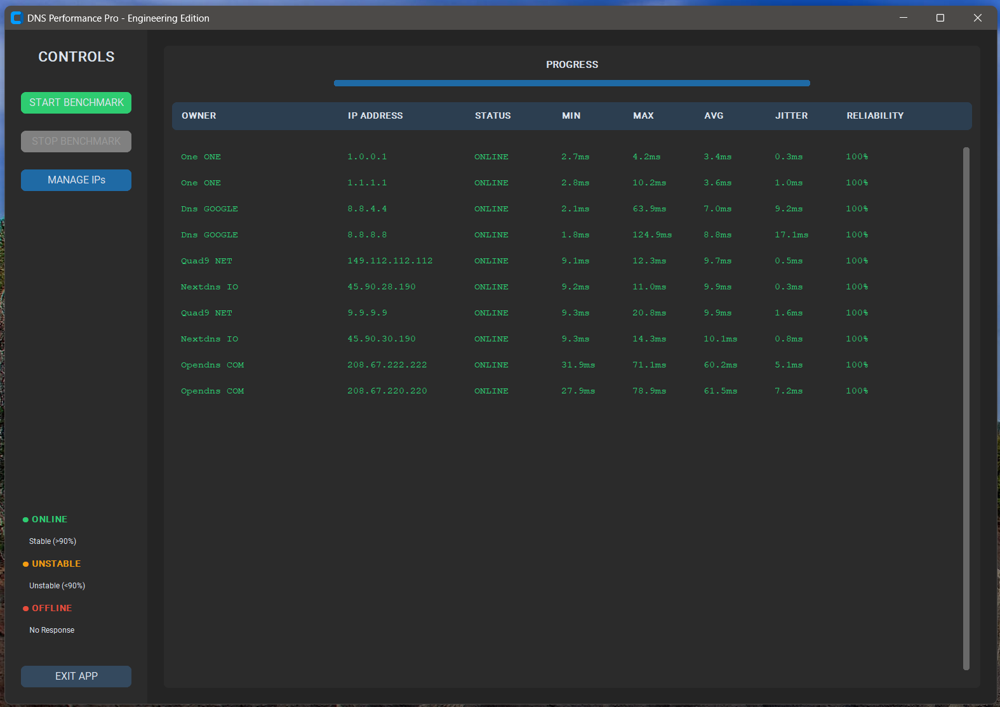
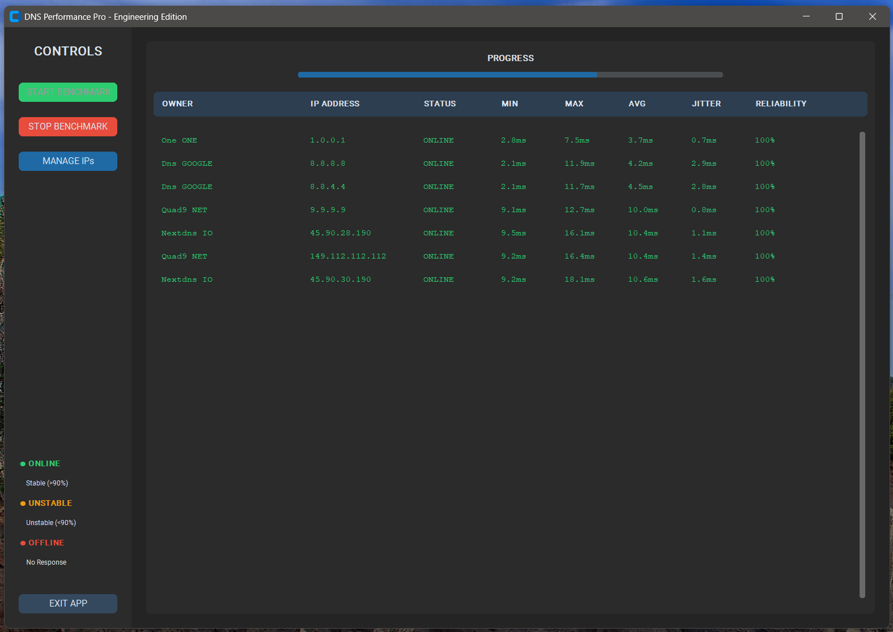
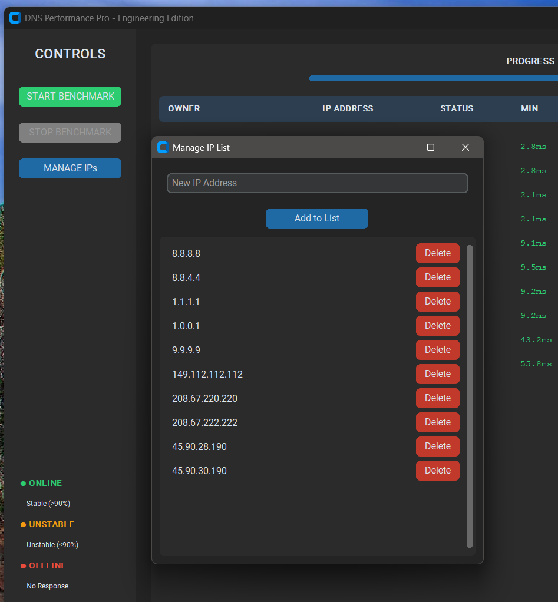
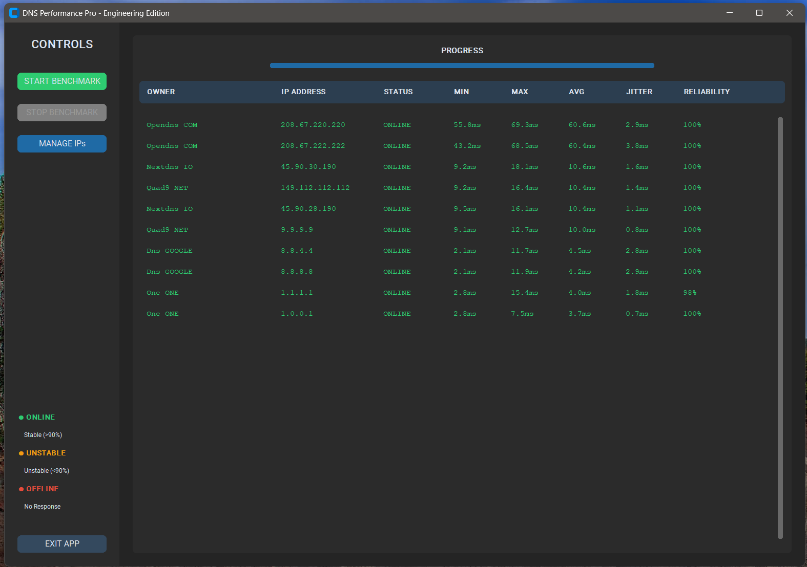
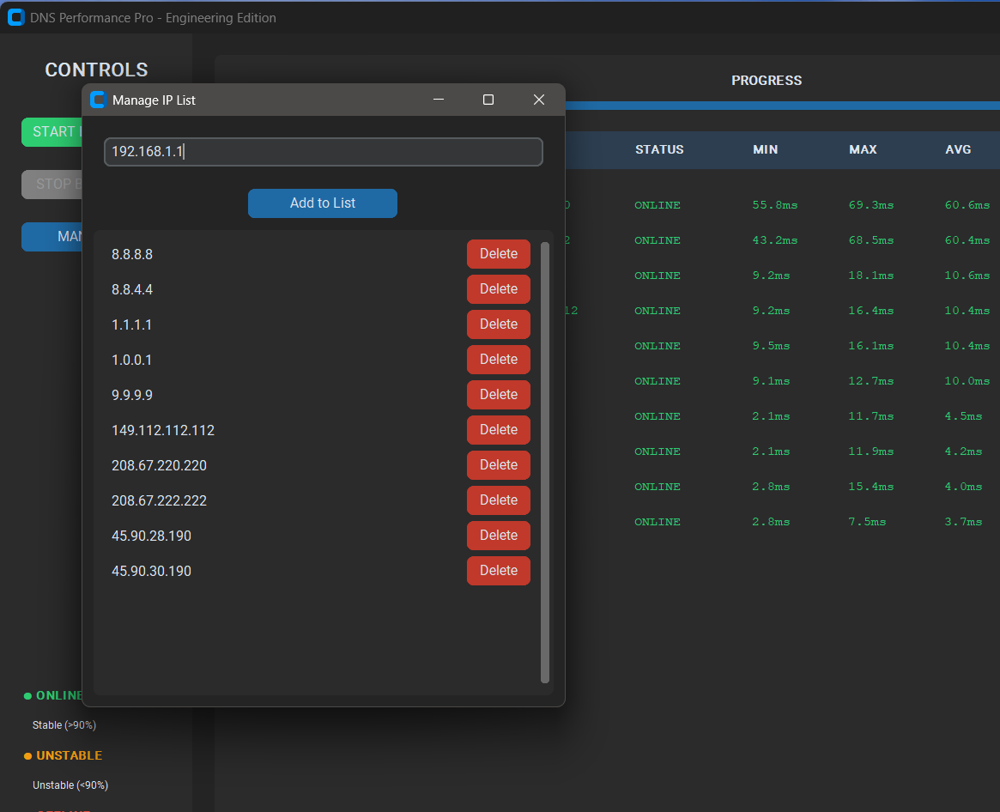

-----

# DNS Benchmark opensource (v1.0)

### High-Precision DNS Benchmarking Tool for SysAdmins & HomeLab Enthusiasts

DNS Benchmark opensource is a multi-threaded, professional-grade benchmarking utility designed to evaluate DNS resolver latency and reliability. Built with **Python 3** and **CustomTkinter**, it provides an interactive, Google Sheets-style interface to analyze network performance across multiple providers simultaneously.

-----

## 🚀 Key Features

  * **High-Precision Sampling:** Performs **50 requests per server** to calculate accurate Min, Max, Avg latency, and Jitter.
  * **Parallel Execution:** Utilizes a `ThreadPoolExecutor` to benchmark up to **15 servers concurrently**, significantly reducing wait times.
  * **Dynamic Provider Identification:** Automatically resolves the **Owner** (ISP/Provider name) in real-time using Reverse DNS (PTR records).
  * **Interactive Table:** Click any column header (OWNER, AVG, RELIABILITY, etc.) to sort results in ascending or descending order.
  * **Automated Cache Management:** Automatically manages `servers.txt` within a dedicated `./cache/` directory, following standard Linux/Windows path conventions.
  * **Visual Progress Tracking:** Real-time progress bar and status-based color coding (Green/Orange/Red).

-----

## 📸 Visual Guide & Usage

### 1\. Main Dashboard

Upon launching, you will see the control sidebar and the results panel.

  * **Start Benchmark:** Clears previous data and begins a new parallel test.


  * **Stop Benchmark:** Gracefully interrupts the current thread pool.


  * **Manage IPs:** Opens a sub-window to add or delete DNS servers from your list.



### 2\. Sorting & Analysis

Just like in **Google Sheets**, click on the column headers to find the fastest or most reliable server.

  * *Example:* Click **AVG** once to see the fastest servers at the top. Click again to see the slowest.


### 3\. IP Management

Add your local gateway (e.g., Pi-hole, AdGuard Home) or enterprise resolvers.


-----

## 🛠️ Technical Setup

### Prerequisites

  * **Python 3.12+** (Tested on Fedora 43 & Windows 11)
  * Network access to perform DNS queries (UDP Port 53)

### Installation

Clone the repository and install the required dependencies:

```bash
# Clone the repo
git clone https://github.com/mariorpn/dns-benchmark-opensource.git
cd dns-benchmark-opensource

# Install dependencies
pip install customtkinter dnspython
```

### Running the App

```bash
python main.py
```

-----

## 📁 Project Structure

```text
.
├── main.py              # Main Application Logic
└── cache/               # Auto-created directory
    └── servers.txt      # Persistent list of DNS IPs
```

-----

## 🛡️ Status Legend

| Status | Description | Color |
| :--- | :--- | :--- |
| **ONLINE** | Reliable connection with \>90% success rate. | Green |
| **UNSTABLE** | Latency detected or \<90% success rate. | Orange |
| **OFFLINE** | No response from the resolver. | Red |

-----

### 💡 Pro Tip for Fedora Users

Since you are on **Fedora 43**, if you encounter issues with the UI scaling, you can force the scale factor by setting the environment variable before running:
`export GDK_SCALE=1 && python main.py`

-----

**Note:** For a production-ready binary version (Windows/Linux/Android) using **Rust**, please refer to the `rust-v1` branch (Work in Progress).
